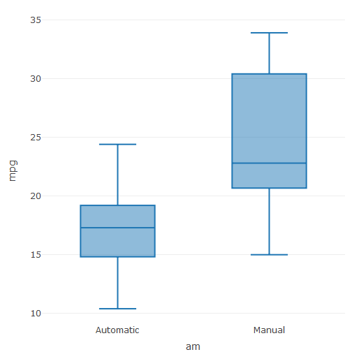

  
  


## Assignment - Plotly example using mtcars dataset

For this example we will try to show the previous analysis the relationship between MPG (Miles Per Gallon) and types of vehicle (automatic/ manual)

```r
library(plotly)
library(webshot)
data(mtcars)
mtcars$am <- as.factor(mtcars$am)
levels(mtcars$am) <- c("Automatic", "Manual")
```


```r
p1 <- plot_ly(
  data = mtcars,
  y = ~mpg,
  x = ~am,
  type = "box"
)
```

----

## Plot Result


```r
p1
```



---

## Thank You

